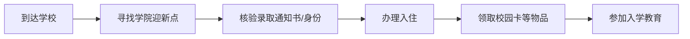

# 报到流程

报到是入学第一课，按照以下流程办理，可以少走弯路。**具体时间、地点以学院官方通知为准。**

## 一、报到时间与地点

- **报到时间**：以录取通知书和学院通知为准，请勿提前或推迟（特殊情况请提前联系辅导员）。
- **报到地点**：烟台大学校内指定地点，学院会设置迎新接待点。
- **接站安排**：学校通常会在报到日在火车站、汽车站、机场设置接站点，出示录取通知书即可找到志愿者。

::: tip 温馨提示
报到当天人流量较大，建议提前规划好时间，错峰到校；如遇困难，随时向佩戴工作证的志愿者或辅导员求助。
:::

## 二、报到流程一览

1. **到达学校** → 前往学院迎新接待点（志愿者引导）
2. **身份核验** → 出示录取通知书、身份证
3. **办理入住** → 凭入住凭证到宿舍楼办理入住
4. **领取物品** → 校园卡、宿舍钥匙、新生资料袋等
5. **入学教育** → 按学院安排参加开学典礼与入学教育

## 三、报到当天流程详解

### 第 1 步：到校

- 跟随接站志愿者或自行到达学校，找到学院迎新点。
- 注意看管好随身行李，贵重物品随身携带。

### 第 2 步：核验身份

- 出示 **录取通知书** 和 **身份证** 原件。
- 工作人员核对身份信息，登记报到。

### 第 3 步：办理入住

- 根据学院安排领取宿舍钥匙/入住凭证。
- 到对应宿舍楼办理入住，领取卧具（如学校统一提供）。

### 第 4 步：领取校园物品

- **校园卡**：就餐、购物、进出宿舍、图书馆借阅等一卡通。
- **新生资料袋**：包含入学教育安排、专业介绍等材料。
- 核对资料袋中的物品是否齐全。

### 第 5 步：参加入学教育

- 按通知参加 **开学典礼**、**安全教育**、**专业介绍** 等活动。
- 加入班级群，认识辅导员和班主任。

## 四、报到常见问题

| 问题 | 解决办法 |
|------|---------|
| 报到当天到晚了 | 联系辅导员说明情况，学院会安排补办 |
| 证件忘记带了 | 第一时间联系辅导员协助处理 |
| 行李太多拿不动 | 学校有志愿者协助搬运 |
| 找不到宿舍楼 | 询问迎新点志愿者，或查看校园地图 |

::: warning 重要提醒
报到期间人员复杂，请保管好个人财物，**不要轻信任何代办、推销、兼职介绍**。如遇可疑情况，及时联系辅导员或学校保卫处。
:::

## 下一步

- 查看 [证件与材料](./documents) 核对报到所需材料
- 有问题？前往 [报到类问题](/faq/register)
